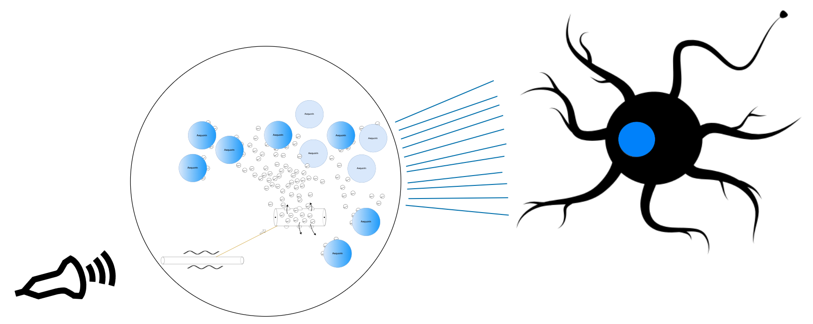
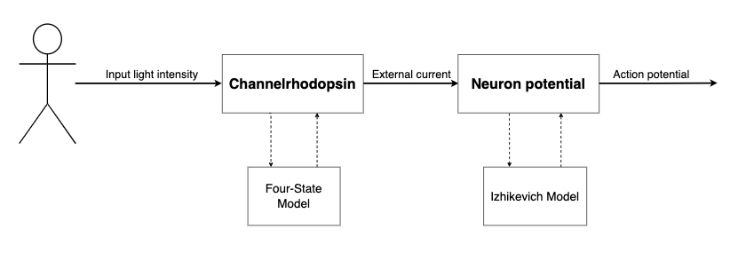
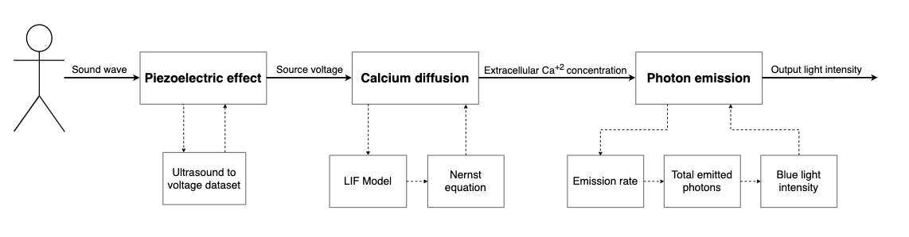

# Simulation Framework for the Bio Neural Dust System

This project implements a simulation framework of the BNDS using Python. 

The main goal of this proposed system is to send an ultrasonic wave to a nano-sphere, called a bio-transceiver, which will emit blue light and activate a neuron that has been genetically modified to express opsin. At a high-level, the system performs the following steps:

1. User emits an ultrasound with a certain intensity.
2. Sound wave makes the bacteriophage vibrate according to its natural resonance frequency.
3. Bacteriophage produces a source voltage due to the piezoelectric effect, which passes through a nanowire connected to the SER.
4. SER’s membrane potential increases, which diffuses Ca2+ into the nano sphere.
5. These diffused ions move around the bubble and bind to the aequorin molecules.
6. As the concentration of diffused Ca2+ increases, more will bind to the aequorin which will emit more photons.
7. The number of emitted photons will produce blue light with a certain intensity.

________________________

## Instructions:

1. Ensure you have the following dependencies
   * `% pip install vpython numpy matplotlib`

2. Open terminal at the folder of the component you which to simulate
   * Open terminal
   * For opsin-expressed neuron:
      - `% cd yourHomeFolder/Bio-Neural-Dust-Simulation/neuron_sim`
   * For bio-transceiver: 
      - `% cd yourHomeFolder/Bio-Neural-Dust-Simulation/nano_bubble`

3. Run simulations scripts:
   * For opsin-expressed neuron: 
      - `% python main.py`
   * For bio-transceiver: 
      - `% python bubble_analysis.py` (outputs graphed results)
      - `% python bubble_3D.py` (runs 3D visualization)
   * For combined framework:
      - `% python combined.py`

-------------------------------------

Component diagrams
-----------------------------------------------------
**Opsin-expressed neuron:**

  

**Bio-transceiver:**

-----------------------------------------------------
